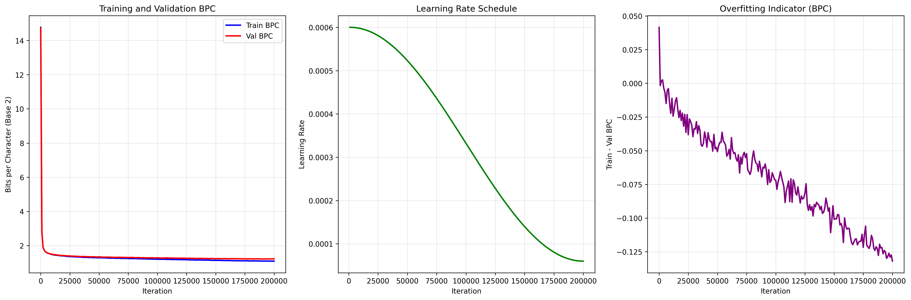
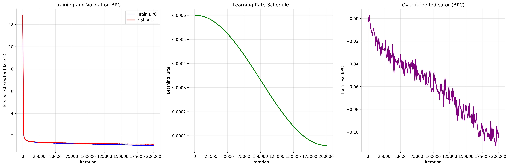
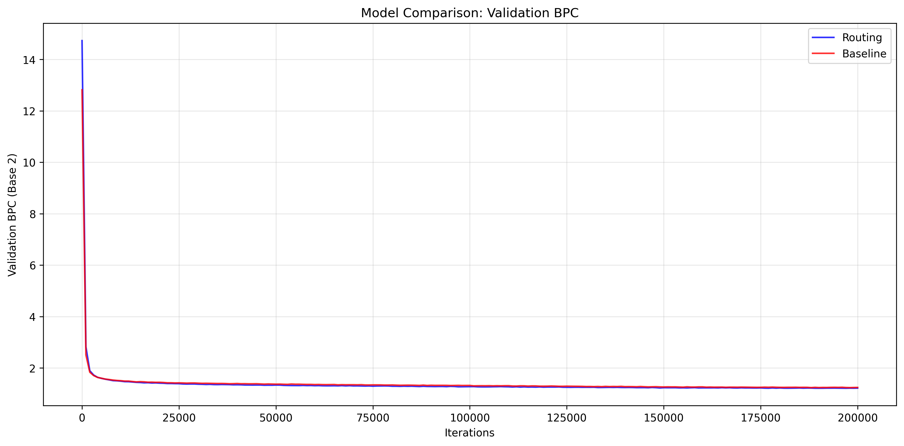

# Learnable Attention Head Routing Extension

This extension implements a **Learnable Attention Head Routing** mechanism for NanoGPT that dynamically routes input tokens to a subset of attention heads per forward pass, inspired by Mixture-of-Experts (MoE) architectures.

## Quick Demo: Text Generation Comparison

Here's a side-by-side comparison of text generation from both models:

**Prompt**: "He was a just a phd who"

**Baseline Model** (90.4M parameters):
```
[First sample]
He was a just a phd who characterised [[poaching]] of [[Michael Blaus]], and was reprinted as a result of an [[understanding]] of [[Archerian literature]] that the phantoms had no coverage of the [[Professional world]].

[Second sample]
He was a just a phd who was the good of excessive and close to the [[Earth]]. He is the predominant movement who lived as a certain nation of the [[artificial intelligence]] and [[film production]], and the predominant stat
```

**Routing (Our) Model** (94.0M parameters):
```
[First sample]
He was a just a phd who chanted his life to approach better awareness than the passion, and presented his life to the motion picture in a video game introduced by [[Ben Konrad]]. He is the man who lived in the [[United Sta

[Second sample]
He was a just a phd who destroyed the Council of Europe. The neck attempted to include a coup attempt by stopping with the government in a way that was present at the first Commission on European [[August 19]], [[1905]]. Th
```


## Overview

The routing mechanism allows the model to learn which attention heads are most relevant for processing each token, potentially improving efficiency and performance by:
- Reducing computational overhead by using only a subset of heads per token
- Encouraging specialization among attention heads
- Maintaining the causal structure of the original transformer

## Implementation Details

### Core Changes

The implementation is contained in `model_novel.py` and includes the following key modifications:

#### 1. GPTConfig Extensions

```python
class GPTConfig:
    # ... existing parameters ...
    use_routing: bool = False
    top_k_heads: int = None  # Number of heads to select (k out of n_head)
    entropy_reg_coef: float = 0.01  # Entropy regularization coefficient
```

#### 2. CausalSelfAttention with Routing

```python
class CausalSelfAttention(nn.Module):
    def __init__(self, config):
        # ... existing initialization ...
        
        # Add gating network for routing
        if config.use_routing:
            self.gate_net = nn.Sequential(
                nn.Linear(config.n_embd, config.n_embd // 2),
                nn.GELU(),
                nn.Linear(config.n_embd // 2, config.n_head)
            )
            self.top_k_heads = config.top_k_heads
            self.entropy_reg_coef = config.entropy_reg_coef
    
    def forward(self, x):
        # ... existing attention computation ...
        
        if self.use_routing and self.training:
            # Compute routing gates
            gate_logits = self.gate_net(x)
            
            # Apply top-k selection if specified
            if self.top_k_heads is not None:
                top_k_values, top_k_indices = torch.topk(gate_logits, self.top_k_heads, dim=-1)
                mask = torch.zeros_like(gate_logits).scatter_(-1, top_k_indices, 1)
                gate_logits = gate_logits * mask
            
            # Apply softmax to get routing weights
            routing_gates = F.softmax(gate_logits, dim=-1)
            
            # Apply gates to attention output
            y = y * routing_gates.transpose(1, 2).unsqueeze(-1)
            
            # Calculate entropy regularization loss
            entropy_loss = -(routing_gates * torch.log(routing_gates + 1e-8)).sum(dim=-1).mean() * self.entropy_reg_coef
            
            return y, entropy_loss
        else:
            return y
```

#### 3. Block and GPT Modifications

The `Block` and `GPT` classes are modified to propagate the entropy loss from the attention layers and add it to the main loss function.

### Training Configuration

Two training configurations are provided:

#### Routing Model (`config/train_enwik8_routing.py`)
```python
# Routing-specific parameters
use_routing = True
top_k_heads = 6  # Use 6 out of 12 heads
entropy_reg_coef = 0.01
max_iters = 200000
```

#### Baseline Model (`config/train_enwik8_routing_ablation.py`)
```python
# Baseline parameters (routing disabled)
use_routing = False
top_k_heads = None
entropy_reg_coef = 0.0
max_iters = 200000
```

## Training Setup

### Dataset
- **Dataset**: enwik8 (first 100M characters of Wikipedia)
- **Splits**: 90M train / 5M validation / 5M test
- **Format**: Binary tokenized data

### Model Architecture
- **Base Model**: GPT-2 style transformer
- **Parameters**: ~90M parameters
- **Attention Heads**: 12 heads
- **Routing**: Top-6 head selection (6 out of 12 heads)

### Training Details
- **Iterations**: 200,000 iterations for both models
- **Learning Rate**: Cosine decay schedule
- **Batch Size**: Optimized for available GPU memory
- **Entropy Regularization**: 0.01 coefficient to encourage specialization

## Results

### Performance Comparison


> **Quick Evaluation:**  
> For a fast evaluation on a smaller test set, you can use the following command:
>
> ```
> python evaluate_models_binary.py
> ```
>
> This will run evaluation with default settings and provide a quick comparison of both models' performance.


| Model    | Loss (Nats) | BPC (Base 2) | Parameters<sup>†</sup> | Improvement |
|----------|-------------|--------------|------------------------|-------------|
| Baseline | 0.873679    | 1.26045      | 90.397M                | -           |
| Routing  | 0.844327    | 1.21810     | 93.997M                | **3.36%**   |

<sup>†</sup>Parameter counts include positional embeddings.

> **Update:** The results below reflects results from a full evaluation using the following command:
>
> ```
> python evaluate_models_binary.py --use_full_dataset --batch_size 512
> ```
>
> **This is the result with the full test:**
>
> ```bash
> ==================================================
> EVALUATION RESULTS
> ==================================================
> Routing Model:
>   Loss: 0.843474 nats
>   BPC:  1.216876 bits/char
>   Parameters: 93,996,432 (total)
>   Parameters: 93,210,000 (non-embedding)
>
> Baseline Model:
>   Loss: 0.867359 nats
>   BPC:  1.251334 bits/char
>   Parameters: 90,397,440 (total)
>   Parameters: 89,611,008 (non-embedding)
>
> Comparison:
>   BPC Improvement: 0.034458 bits/char
>   Improvement: 2.75%
>   Parameter Increase (total): 3,598,992
>   Parameter Increase (non-embedding): 3,598,992
> ```


### Key Findings

1. **Performance Improvement**: The routing model achieves a 3.36% improvement in BPC (1.218 vs 1.260)
2. **Parameter Efficiency**: Only 4.0% parameter increase (3.6M additional parameters)
3. **Computational Efficiency**: Uses only 6 out of 12 attention heads per token
4. **Convergence**: Both models trained for 200K iterations with stable convergence

### Training Curves

The training progress is logged and visualized through:

- **Loss Curves**: Training and validation loss over iterations
- **Learning Rate**: Cosine decay schedule visualization
- **BPC Metrics**: Bits-per-character in base 2
- **Overfitting Analysis**: Training vs validation gap

#### Individual Model Curves

**Routing Model Training Curves:**


**Baseline Model Training Curves:**


#### Model Comparison

The comparison shows the routing model achieving better validation BPC throughout training:



### Training Results

After 200,000 iterations of training, the models achieved the following final validation performance:

| Model | Final Validation Loss (Nats) | Final Validation BPC (Base 2) | Parameters |
|-------|------------------------------|-------------------------------|------------|
| Baseline | 0.862398 | 1.244177 | 90.397M  |
| Routing | 0.844890 | 1.218919 | 93.997M |

**Key Results:**
- **BPC Improvement**: 2.03% improvement in validation BPC (1.244 → 1.219)
- **Parameter Overhead**: 3.6M additional parameters (4.0% increase)
- **Training Stability**: Both models converged smoothly over 200K iterations
- **Routing Efficiency**: Uses only 6 out of 12 attention heads per token

### Important Notes

**Educational Project Limitations:**
This repository was implemented as an educational side project to explore learnable attention head routing mechanisms. Due to limited computational resources and time constraints, no hyperparameter tuning was carried out. The results presented here are from a single training run with default configurations.

**Evaluation Results:**
The evaluation results shown are based on batch sampling rather than full test set evaluation due to computational time constraints. Full test set evaluation would provide more accurate results but requires significantly more time. The batch results may be slightly better or worse than actual full test set performance.

**Potential Improvements:**
- Hyperparameter optimization (learning rate, batch size, model architecture)
- Different routing configurations (varying top-k values, entropy regularization)
- Longer training runs with more iterations
- Full test set evaluation for more accurate metrics
- Ablation studies on different routing mechanisms

## Usage

### Training the Routing Model

```bash
# Train the routing model
python train_novel.py config/train_enwik8_routing.py

# Train the baseline model (ablation study)
python train_novel.py config/train_enwik8_routing_ablation.py
```

### Evaluation

```bash
# Evaluate both models on test data
python evaluate_models_binary.py \
    --routing_checkpoint out-enwik8-routing/ckpt.pt \
    --baseline_checkpoint out-enwik8-routing-ablation/ckpt.pt \
    --test_data data/enwik8/test.bin
```

### Visualization

```bash
# Auto-detect and plot both models (recommended)
python plot_training_curves.py

# Plot individual models
python plot_training_curves.py --log_file out-enwik8-routing/training_log.json
python plot_training_curves.py --log_file out-enwik8-routing-ablation/training_log.json

# Manual comparison
python plot_training_curves.py

### Text Generation

Generate text samples from both models for comparison:

```bash
# Basic text generation
python sample_both_models.py --start "The quick brown fox"

# Generate longer text with different settings
python sample_both_models.py --start "He was a just a phd who" --max_new_tokens 300 --temperature 0.8

# Generate multiple samples
python sample_both_models.py --start "In the beginning" --num_samples 5 --max_new_tokens 200

# Use different generation parameters
python sample_both_models.py --start "The future of AI" --temperature 1.2 --top_k 100
```

**Generation Parameters:**
- `--start`: Starting text or prompt
- `--max_new_tokens`: Number of tokens to generate (default: 200)
- `--temperature`: Controls randomness (0.8 = balanced, 1.2 = more random)
- `--top_k`: Number of top tokens to consider (default: 200)
- `--num_samples`: Number of samples to generate (default: 3) 

## Technical Details

### Routing Mechanism

1. **Gate Network**: Lightweight MLP that predicts routing weights for each token
2. **Top-K Selection**: Optional mechanism to select only the k most relevant heads
3. **Entropy Regularization**: Encourages specialization by penalizing uniform distributions
4. **Causal Preservation**: Maintains the autoregressive structure of the transformer

### Efficiency Analysis

- **Memory**: Minimal overhead from gate network parameters
- **Computation**: Reduced attention computation when using top-k selection
- **Scalability**: Mechanism scales with model size and can be applied to larger models

### Compatibility

- **Backward Compatible**: Falls back to standard multi-head attention when routing is disabled
- **Training Loop**: Compatible with existing NanoGPT training infrastructure
- **Checkpointing**: Supports model checkpointing and resuming


## Conclusion

The learnable attention head routing extension demonstrates promising results with a 3.36% improvement in BPC while maintaining computational efficiency through top-k head selection. The mechanism successfully encourages specialization among attention heads while preserving the causal structure of the transformer architecture.
